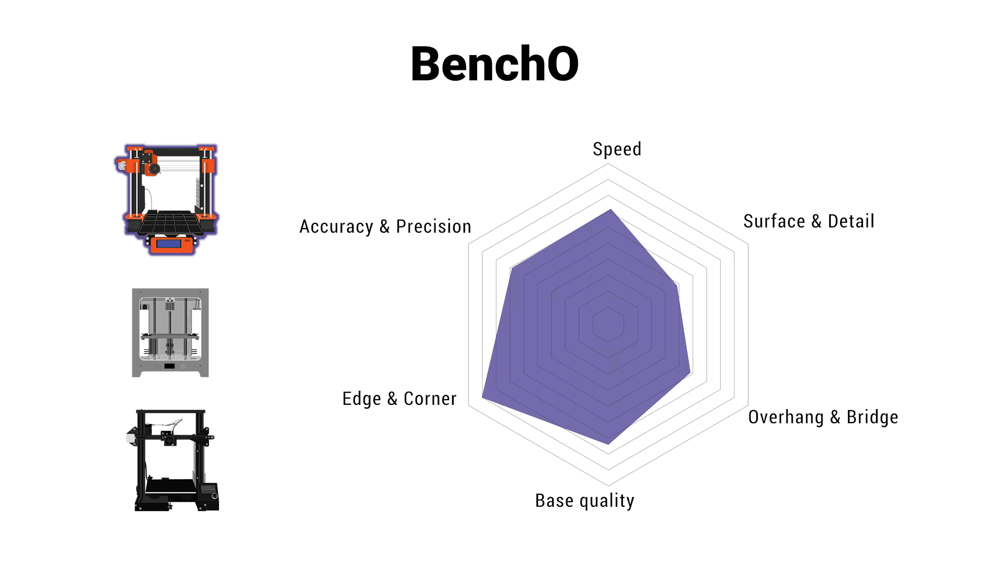

# BenchO

## A universal test standard for 3D printers.

- #### Comprehensive
- #### Practical
- #### Professional 
## Aims of BenchO
- #### To test and compare the performance of various 3D printers
- #### To discuss and optimize profiles for different situation
- #### To calibrate and improve your printers
- #### To improve 3D printing experience for everyone
## Table of Contents
#### BenchO in a nutshell
- [What is BenchO?](#what-is-bencho)
- [Why we do this?](#why-we-do-this)
- [How do we achieve our goal?](#how-do-we-achieve-our-goal)
#### Test with BenchO
- [Preparation](#preparation)
- [Standard Test](#standard-fdm-test)
- [FAQs](#faqs)
- [Contributing](#contributing)
- [License](#license)
#### How to reach us
- [Contact infomation](#contact-infomation)

### What is BenchO?
BenchO is an open source project started by **Better Printer Institution LLC**.  Aiming to provide a universal test standard for the industry.  In our test, we provide specialized models and procedure to estimate the capability of your 3D printer.We will also provide optimized profile(in slicing software) for makers all over the world to suit thier needs. 

The current version contains protocols for consumer grade FDM printer. More test protocols will be added later in the future. The project is entirely open source.

In summary this is a place to **test, evaluate**,**discuss** and **improve** your 3D printer.

### Why we do this?

There are many 3D printers in the market and they are in all kinds of shapes and structures. For users it is really difficult to tell how much the difference really is between them.

How is the actual performance compare to what they advertised? Where is the limit of your printer? These questions are usually hard to find out.Besides that, even if you tried to find those answers, there is no such thing as a universal benchmark for you to discuss and compare with other machines. 

Thus we decide to make a universal, data based, open sourced project as you seen here. 

We believe that by making a universal standard for 3D printers, we could make this field better in the future.

### How do we achieve our goal?

In this project we currently provide a sufficient offline tool. This tool will allow 3D printer users get to know the capabilities of their machines and thus improve the performance of their printers. Our current test will be the starting point of BenchO.

## Standard FDM test

### Preparation for FDM 3D printer

- **eSUN PLA+ filament (Grey)** as standard test filament
- The 3D printer you want to test with
- A caliper with resolution up to 0.01mm and range larger than 100mm
- [BenchO Tool]() ([Offline version](Standard%20FDM%20test/BenchO_offline_ver20190902.xlsx))
- [Test Models](3Dmodel)

####
Check **[here](Standard%20FDM%20test)** to participate in BenchO test.

## FAQs
- **Q**: Why eSUN PLA+ with Grey color?
- **A**: eSUN filament is widely available all across the world. This makes BenchO testers having same material so the result is comparable. Grey is for checking surface details. We found this color be good to spot defects in your art print.
####
- **Q**:I saw the project is started by Better Printer Institution LLC. But why are you guys making profiles and improvements even for your competitors?
- **A**:Because we want a better community overall. Moderate competition and more cooperation will greatly improve the quality of 3D printing communities.This will eventually benefit us all,both users and companies.
## Maintainers

BenchO Team

## Contributing

See [the contributing file](CONTRIBUTING.md)!

Small note: If editing the Readme, please conform to the [standard-readme](https://github.com/RichardLitt/standard-readme) specification.

## License
This project is licensed under the Apache License, Version 2.0. See
[LICENSE](LICENSE)
## Contact Infomation
- The offical website:[http://foldy3d.com/](http://foldy3d.com/) 
- The Facebook Page:[https://www.facebook.com/BetterPrint3r/](https://www.facebook.com/BetterPrint3r/)
